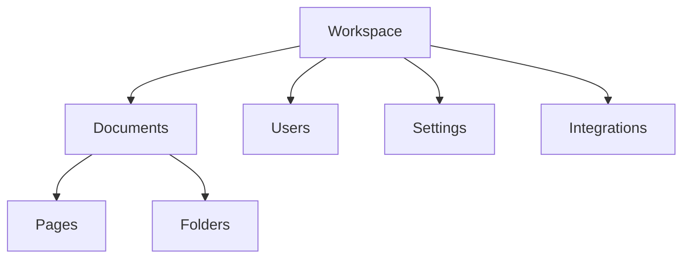

## Overview

Ivan Kiryanov organizes your project documentation into intuitive structures that scale with your needs. You manage workspaces, build document hierarchies, track versions, and customize workflows to fit your team. Grasp these concepts to build efficient documentation spaces.

<Columns cols={2}>
  <Card title="Workspace Structure" icon="layers" href="#workspace-structure">
    Organize projects into isolated workspaces with shared resources.
  </Card>
  <Card title="Document Hierarchies" icon="file-tree" href="#document-hierarchies">
    Create nested pages and folders for logical content organization.
  </Card>
  <Card title="Version Control" icon="git-branch" href="#version-control">
    Track changes with branching and merge capabilities.
  </Card>
  <Card title="Customization" icon="sliders" href="#customization">
    Tailor interfaces and behaviors to your workflow.
  </Card>
</Columns>

## Workspace Structure

Workspaces serve as top-level containers for your documentation projects. Each workspace includes documents, users, settings, and integrations. You create separate workspaces for different clients or products to maintain isolation.



To create a workspace via API:

<CodeGroup tabs="JavaScript,Python">
  ```javascript
  const response = await fetch('https://api.example.com/v1/workspaces', {
    method: 'POST',
    headers: { 'Authorization': 'Bearer YOUR_API_KEY' },
    body: JSON.stringify({
      name: 'My Project Docs',
      description: 'Documentation for Project X'
    })
  });
  ```
  ```python
  import requests
  response = requests.post(
      'https://api.example.com/v1/workspaces',
      headers={'Authorization': 'Bearer YOUR_API_KEY'},
      json={'name': 'My Project Docs', 'description': 'Documentation for Project X'}
  )
  ```
</CodeGroup>

<Callout kind="tip">
  Assign users to workspaces during creation to enable collaboration from the start.
</Callout>

## Document Hierarchies

Documents form tree-like structures with pages nested under folders or other pages. You navigate hierarchies via sidebar or breadcrumbs. This setup mirrors file systems but adds rich text and embeds.

| Element       | Description                          | Example Use Case              |
|---------------|--------------------------------------|-------------------------------|
| Workspace    | Top-level container                 | Client project docs          |
| Folder       | Groups related pages                | API Reference, Guides        |
| Page         | Individual document with content    | Authentication Guide         |
| Sub-page     | Nested under parent page            | Error Codes (under API)      |

Use the API to create hierarchies:

<ParamField path="workspaceId" param-type="string" required="true">
  ID of the parent workspace.
</ParamField>

<ParamField path="parentId" param-type="string" required="false">
  ID of parent folder or page for nesting.
</ParamField>

## Version Control Basics

Version control in Ivan Kiryanov lets you branch documents, commit changes, and merge updates. You review diffs and rollback as needed, similar to Git but optimized for docs.

<Steps>
  <Step title="Create Branch" icon="git-branch">
    Branch a page to experiment without affecting the main version.
  </Step>
  <Step title="Make Changes" icon="edit-3">
    Edit content in your branch.
  </Step>
  <Step title="Review & Merge" icon="git-merge">
    Compare diffs and merge back to main.
  </Step>
</Steps>

<Callout kind="info">
  Branches auto-expire after 30 days of inactivity unless pinned.
</Callout>

## Customization Principles

Tailor Ivan Kiryanov to your needs with themes, templates, and API extensions. Follow these principles: keep it simple, ensure accessibility, and test across devices.

<Tabs>
  <Tab title="Themes" icon="palette">
    Customize colors using your brand palette, like `#3B82F6` for primary blue.
    
    ```css
    :root {
      --primary-color: #3B82F6;
      --text-color: #1F2937;
    }
    ```
  </Tab>
  <Tab title="Templates" icon="file-plus">
    Define reusable page templates for consistency.
    
    <Expandable title="Advanced Template Example" default-open="false">
      Templates support variables like `{projectName}` for dynamic content.
    </Expandable>
  </Tab>
</Tabs>

<ExpandableGroup>
  <Expandable title="Version Control Deep Dive" default-open="true">
    Explore merge conflicts resolution and cherry-picking changes across branches.
  </Expandable>
  <Expandable title="Scaling Hierarchies">
    For large docs, use index pages with automated TOC generation.
  </Expandable>
</ExpandableGroup>