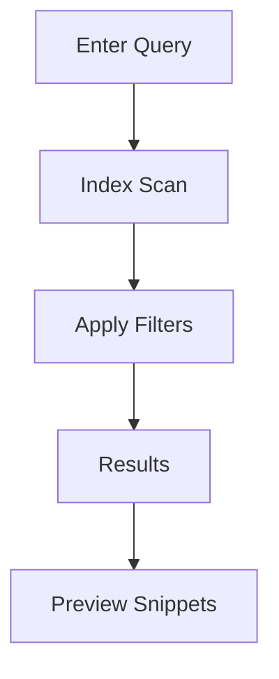

## Overview

Ivan Kiryanov provides powerful tools to organize, collaborate, search, and export your documentation efficiently. You can structure projects with folders and tags, invite team members for real-time edits, find content instantly with advanced search, and export to various formats for sharing.

<Columns cols={3}>
  <Card title="Organization" icon="folder" href="#document-organization">
    Structure your docs with folders, tags, and versioning.
  </Card>
  <Card title="Collaboration" icon="users" href="#collaboration">
    Share and edit docs with your team seamlessly.
  </Card>
  <Card title="Search" icon="search" href="#search">
    Find exactly what you need with filters and full-text search.
  </Card>
</Columns>

<Callout kind="tip">
  Start by creating a new project to experience these features hands-on.
</Callout>

## Document Organization Methods

Organize your documentation using intuitive methods like folders, tags, and custom hierarchies.

<Tabs>
  <Tab title="Folders" icon="folder">
    Create nested folders to group related pages.

    <Steps>
      <Step title="Create Folder" icon="plus">
        Navigate to your project sidebar and click `New Folder`.
      </Step>
      <Step title="Nest Pages" icon="chevron-down">
        Drag pages into folders for hierarchy.
      </Step>
      <Step title="Reorder" icon="move">
        Use drag-and-drop to adjust structure.
      </Step>
    </Steps>
  </Tab>
  <Tab title="Tags" icon="tag">
    Apply tags for cross-folder organization.

````jsx
// Example: Adding tags via API
fetch('https://api.example.com/docs/{docId}/tags', {
  method: 'POST',
  headers: { 'Authorization': 'Bearer YOUR_TOKEN' },
  body: JSON.stringify({ tags: ['api', 'guide'] })
});
````
  </Tab>
</Tabs>

## Collaboration and Sharing

Invite team members and share docs securely. You control permissions for view, edit, or admin access.

<CodeGroup tabs="Invite,Share Link">
```javascript
// Invite user via API
await fetch('https://api.example.com/projects/{projectId}/invites', {
  method: 'POST',
  body: JSON.stringify({
    email: 'user@example.com',
    role: 'editor'
  })
});
```
```bash
# Generate shareable link
curl -X POST https://api.example.com/docs/{docId}/share \
  -H "Authorization: Bearer YOUR_TOKEN" \
  -d '{"public": true}'
```
</CodeGroup>

<Expandable title="Advanced Permissions" default-open="false">
  Set granular permissions like "comment only" for reviewers.

  | Role       | View | Edit | Admin |
  |------------|------|------|-------|
  | Viewer     | ✅   | ❌   | ❌    |
  | Editor     | ✅   | ✅   | ❌    |
  | Admin      | ✅   | ✅   | ✅    |
</Expandable>

## Search and Filtering Tools

Search across your entire documentation space with full-text search, filters, and saved queries.

<Callout kind="info">
  Search supports Boolean operators like `api AND authentication`.
</Callout>



Use the API for programmatic search:

<ParamField path="query" param-type="string" required="true">
  Your search terms, e.g., `authentication flow`.
</ParamField>

<ParamField query="tags" param-type="array" required="false">
  Filter by tags like `["api", "guide"]`.
</ParamField>

## Export Options

Export your docs to PDF, HTML, or Markdown archives.

<Steps>
  <Step title="Select Export" icon="download">
    Go to project settings > Export.
  </Step>
  <Step title="Choose Format" icon="file-text">
    Pick PDF for print-ready or Markdown for GitHub.
  </Step>
  <Step title="Customize" icon="settings">
    Include/exclude sections and add watermarks.
  </Step>
</Steps>

| Format    | Use Case                  | File Size |
|-----------|---------------------------|-----------|
| PDF       | Printing, sharing         | Large    |
| HTML      | Web embedding             | Medium   |
| Markdown  | Version control, import   | Small    |

<Columns cols={2}>
  <Card title="Next: Quickstart" icon="rocket" href="/quickstart">
    Set up your first project.
  </Card>
  <Card title="Authentication" icon="lock" href="/authentication">
    Secure your docs.
  </Card>
</Columns>